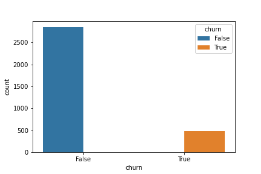

# SyriaTel Customer Churn ML Project

**Project by**:

- **Name**:  Julius Kinyua Njeri
- **Email**: juliusczar36@gmail.com
- **Date**: June 2024
- **Github Link**: https://github.com/CzarProCoder/SyriaTel_Customer_Churn_ML
- **LinkedIn**: https://www.linkedin.com/in/julius-kinyua
- **Twitter(X)**: https://x.com/Juliuskczar
- **Website**: https://lyonec.com/

# Project Overview

SyriaTel, a telecommunications company, is concerned about customer churn, where customers stop using their services. To address this, the company has gathered data on customer behavior to identify those likely to leave and implement strategies to retain them, as losing customers is costly.

SyriaTel, a telecommunications company, is concerned about customer churn, where customers stop using their services. To address this, the company has gathered data on customer behavior to identify those likely to leave and implement strategies to retain them, as losing customers is costly.

The term “**churn**” refers to customers leaving the company, and the current churn rate is approximately 14%. Aiming to reduce this rate to about 7%.

The project utilized the provided dataset to address key questions:

- Identifying the main features that determine customer churn
- Uncovering any predictable patterns
- Exploring how SyriaTel can leverage these insights to implement cost-effective solutions.

The project aims to develop a classification model to predict customer churn using machine learning techniques. Following the CRISP-DM methodology, the project involves six stages: Business Understanding, Data Understanding, Data Preparation, Modeling, Evaluation, and Deployment. By analyzing the dataset, we aim to uncover patterns and factors driving customer churn and create a predictive model to help reduce customer attrition.

# I: Business Understanding

**Problem Statement**

SyriaTel, a telecommunications company, is experiencing high customer churn as many customers switch to competitors. To address this, the company aims to develop a churn prediction model to identify factors associated with churn and improve customer retention, ultimately boosting profitability.

**Objectives and Success Metrics**

The project aims to:

- Identify key factors leading to customer churn.
- Develop an accurate churn prediction model.
- Implement strategies to retain at-risk customers.

Success will be measured by:

- Achieving a recall score of 0.8 with the prediction model.
- Identifying significant features contributing to churn.
- Providing actionable recommendations to reduce churn and enhance retention.
- Demonstrating the value of proactive retention strategies in reducing revenue losses.

